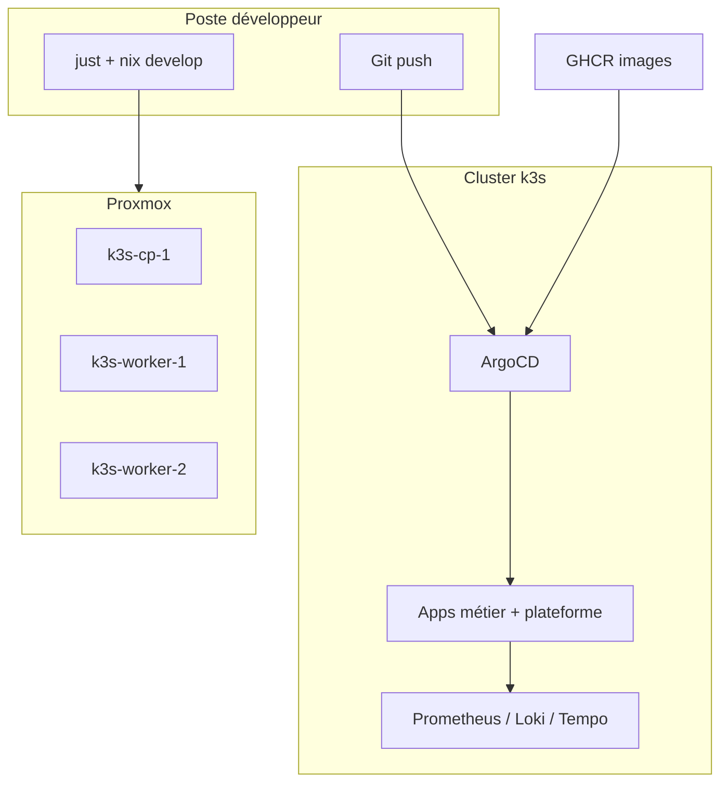

# projet-etude — Cluster k3s GitOps sur Proxmox

[](https://github.com/Waddenn/projet-etude-M1/actions/workflows/validate.yml)

Projet d'études M1 DevOps : déploiement reproductible et déclaratif d'un cluster
Kubernetes 3 nœuds (k3s) sur des VMs Proxmox, géré end-to-end avec NixOS,
ArgoCD (GitOps), sops-nix (secrets) et Tailscale (accès distant).

**Dépôts liés**

| Dépôt | Rôle |
| ----- | ---- |
| [projet-etude-M1](https://github.com/Waddenn/projet-etude-M1) (ce repo) | Infra NixOS, manifests Kubernetes, GitOps |
| [projet-etude-app-demo](https://github.com/Waddenn/projet-etude-app-demo) | Application Go (api, worker, audit-purge) → GHCR |

## Objectifs pédagogiques

- Provisionner un cluster **reproductible** (NixOS flake + Proxmox + nixos-anywhere).
- Opérer en **GitOps** (ArgoCD bootstrap déclaratif, ApplicationSet, Image Updater).
- Gérer les **secrets** à plusieurs niveaux (dev-side, sops-nix, Vault + ESO).
- Mettre en place l'**observabilité SRE** (métriques, logs, traces, SLO, alerting).
- Démontrer la **résilience** (HPA, PDB, chaos engineering, burn-rate alerts).

## Architecture



Détail : [`docs/architecture.md`](./docs/architecture.md).

## Stack

| Couche                | Outil                       |
| --------------------- | --------------------------- |
| Hyperviseur           | Proxmox VE (3 VMs : 2 vCPU / 6 GiB / 32 GB) |
| OS des nœuds          | NixOS 25.11 (flake)         |
| Provisionnement       | nixos-anywhere (kexec)      |
| Cluster Kubernetes    | k3s (1 control-plane, 2 workers) |
| GitOps                | ArgoCD + Image Updater (write-back Git, digests épinglés) |
| Secrets cluster       | sops-nix (age dérivé des SSH host keys persistantes) |
| Secrets runtime       | Vault (DEV) + External-Secrets Operator |
| Auth                  | Dex (OIDC IdP) — viewer / operator |
| Réseau VPN            | Tailscale + tailscale serve (HTTPS tailnet) |
| Ingress               | Traefik (intégré k3s) + middleware StripPrefix |
| Métriques             | kube-prometheus-stack 65.5.1 (Prometheus + Alertmanager + Grafana) |
| Logs                  | Loki 6.16 + Alloy 0.10 (DaemonSet) |
| Traces                | Tempo 1.24 (OTLP gRPC, exemplars trace\_id) |
| Sécurité images       | Trivy en CI (CRITICAL/HIGH bloquant) + trivy-operator dans le cluster |
| Green IT              | Kepler (estimation conso énergétique) |
| Base de données       | CloudNative-PG (PostgreSQL 16.4) |
| App de démo           | Go 1.25 — tracker d'incidents (api + worker + audit-purge) |
| CI/CD                 | GitHub Actions (validate.yml infra, build.yml app → GHCR) |
| Runner de tâches      | just (devShell Nix) |

## Prérequis

| Élément | Détail |
| ------- | ------ |
| OS poste dev | Linux ou **WSL2** (le `justfile` utilise bash) |
| Nix | Flakes activés — `nix develop ./nixos` |
| distrobox | Conteneur `nix-deploy` pour `just deploy` / `switch` |
| Proxmox | Host SSH accessible (`just pve` → `root@proxade` par défaut) |
| Template VM | `proxmox/create-template.sh` exécuté une fois sur PVE |
| Tailscale | Compte + pre-auth key réutilisable |
| GitHub | Fork du repo si vous changez `repoUrl` dans `nixos/hosts/k3s-cp-1.nix` |
| Deploy key | Clé SSH lecture/écriture pour Argo CD Image Updater (dans sops) |

### Personnalisation (valeurs par défaut)

| Paramètre | Fichier | Valeur actuelle |
| --------- | ------- | --------------- |
| IP control-plane | `justfile`, `nixos/flake.nix` | `192.168.1.61` |
| IP workers | idem | `.62`, `.63` |
| IDs VM Proxmox | `justfile` `recreate` | `301`, `302`, `303` |
| Host Proxmox | `justfile` | `proxade` |
| Repo GitOps ArgoCD | `nixos/hosts/k3s-cp-1.nix` | `https://github.com/Waddenn/projet-etude-M1.git` |
| ApplicationSet | `kubernetes/applications/platform/apps-applicationset.yaml` | même repo, branche `main` |

Variables optionnelles : copier [`.env.example`](./.env.example) vers `.env`.

## Arborescence

```
.
├── README.md
├── AUDIT.md             # audit technique du projet
├── justfile             # tâches projet : just <recipe>
├── .env.example         # variables d'environnement (just)
├── docs/
│   ├── architecture.md
│   ├── cahier-des-charges.md
│   └── demo-soutenance.md
├── proxmox/             # scripts côté Proxmox (clone VMs, installation)
├── nixos/               # flake + modules + hosts (source de vérité OS)
│   ├── flake.nix
│   ├── .sops.yaml
│   ├── modules/         # common, k3s, tailscale, secrets, k8s-bootstrap…
│   ├── hosts/           # k3s-cp-1, k3s-worker-{1,2}
│   └── secrets/         # secrets sops-encrypted (k3s_token, …)
├── kubernetes/
│   ├── applications/    # Applications Argo CD (root app → ce dossier)
│   │   ├── monitoring/  # Prometheus, Loki, Alloy, Tempo
│   │   ├── platform/    # AppSet, Image Updater, dashboards, Traefik NodePort
│   │   ├── security/    # Vault, ESO, Dex, Trivy Operator
│   │   ├── data/        # CloudNative-PG
│   │   └── observability/  # Kepler
│   ├── apps/            # 1 dossier = 1 app via ApplicationSet
│   │   └── projet-etude-app-demo/
│   └── loadtest/        # jobs hey, chaos probe/partition
└── secrets/             # clés dev-side (gitignored, cf. secrets/README.md)
```

## Installation

### Démarrage rapide

```bash
nix develop ./nixos
# secrets : cf. secrets/README.md
just redeploy
just kubeconfig
export KUBECONFIG=~/.kube/projet-etude
just nodes && just argocd-apps
```

### Première installation (détaillée)

```bash
# 1. DevShell
nix develop ./nixos

# 2. Secrets dev-side
ssh-keygen -t ed25519 -N "" -C projet-etude-k3s -f secrets/ssh-deploy-key
# tailscale-authkey → secrets/tailscale-authkey

# 3. sops (clé dev + host keys persistantes)
just sops-init
# Coller la pubkey age dans nixos/.sops.yaml
just sops-bootstrap
just sops-edit   # k3s_token, discord_webhook_url, deploy key Image Updater

# 4. Template Proxmox (une fois) puis déploiement
# ssh root@proxade 'bash -s' < proxmox/create-template.sh
just redeploy

# 5. Accès cluster
just kubeconfig
export KUBECONFIG=~/.kube/projet-etude
just nodes
just argocd-apps
```

## Accès aux UIs

Une fois le cluster up, les UIs sont exposées sur le tailnet par tailscale serve :

| UI         | URL                                               | Login          |
| ---------- | ------------------------------------------------- | -------------- |
| ArgoCD     | `https://k3s-cp-1.<votre-tailnet>.ts.net` | admin / *(cf. `just argocd-password`)* |
| Grafana    | `https://k3s-cp-1.<votre-tailnet>.ts.net:8443` | admin / admin |
| Traefik / app-demo | `https://k3s-cp-1.<votre-tailnet>.ts.net:9443/app-demo` | OIDC Dex |

Port-forward local : `just argocd-ui`, `just grafana`, `just prometheus`.

## Scénario de démo

```bash
just demo    # vérifie status, nodes, ArgoCD, URL app
```

Scénario complet (~15 min) : [`docs/demo-soutenance.md`](./docs/demo-soutenance.md).

## Observabilité & SLO

- **Dashboards Grafana** : *Platform overview*, *App demo (métier)*, *SLO & burn-rate*, *Worker & queue*.
- **SLO disponibilité** : 99,5 % (burn-rate multi-fenêtres, cf. `kubernetes/apps/projet-etude-app-demo/prometheusrule.yaml`).
- **Alerting** : Alertmanager → webhook Discord (secret sops).
- **Traces** : OTLP → Tempo, propagation `jobs.trace_context` jusqu'au worker.
- **Kepler** : métriques énergie au niveau pod/nœud (dashboard plateforme).

## Chaos engineering

```bash
just chaos-kill          # tue 1 pod api random
just chaos-schedule      # CronJob killer (30 min)
just chaos-unschedule    # désactive le CronJob
just chaos-partition     # NetworkPolicy deny-all 60 s
just chaos-probe         # 5 min /healthz à 20 rps
just chaos-cpu           # charge CPU (HPA)
just demo-flaky          # 50 % d'erreurs → burn-rate fast
just demo-slow           # latence 800 ms → alerte p95
just demo-panic          # panic récupérée + logs
just demo-crash          # OOM simulé
just demo-memleak        # fuite mémoire progressive
```

## Workflow GitOps

1. Modifier un manifest dans `kubernetes/applications/` ou `kubernetes/apps/`.
2. `git push` → ArgoCD sync (auto-prune + self-heal).
3. Changement OS : modifier `nixos/` → `just switch` (ou `just redeploy` si VMs neuves).
4. Nouvelle image app : CI app → GHCR → Image Updater commit digest → resync.

```
push image (CI app) → GHCR → Image Updater → commit kustomization.yaml → ArgoCD sync
```

## Recettes `just`

```bash
just                  # liste complète
just demo             # checks soutenance

# Déploiement
just deploy           # nixos-anywhere (3 VMs)
just switch           # nixos-rebuild switch
just redeploy         # recreate + deploy
just recreate         # destroy/recreate VMs Proxmox
just status           # état des 3 nœuds
just kubeconfig       # ~/.kube/projet-etude

# Kubernetes / ArgoCD
just nodes | just pods | just k get …
just argocd-apps | just argocd-sync | just argocd-password

# App démo / charge
just loadtest | just hpa-watch | just app-status | just app-demo-url

# Monitoring
just grafana | just prometheus | just mon-status

# Secrets sops
just sops-init | just sops-bootstrap | just sops-edit | just sops-rotate | just sops-host-keys
```

## Sécurité — secrets

- **Dev-side** (`secrets/`) : SSH deploy, Tailscale, host keys — voir [`secrets/README.md`](./secrets/README.md).
- **Cluster** (`nixos/secrets/secrets.yaml`) : k3s token, Discord, deploy key Image Updater (sops + age).
- **Runtime** : Vault DEV + External-Secrets (`oidc-client`, `app-session`, …).
- **App** : OIDC Dex (`viewer` / `operator`), audit log, purge RGPD 90 j (CronJob).

## CI/CD

- **Infra** — [`.github/workflows/validate.yml`](./.github/workflows/validate.yml) : yamllint, actionlint, shellcheck, kubeconform, `nix flake check`, kube-score.
- **App** — repo [projet-etude-app-demo](https://github.com/Waddenn/projet-etude-app-demo) : lint, tests, build, Trivy, push GHCR.
- **Livraison** : Argo CD Image Updater → commit digest dans `kustomization.yaml` → resync.

## Dépannage

| Symptôme | Piste |
| -------- | ----- |
| SSH timeout sur redeploy | `just ping`, `just wait-ssh`, vérifier IPs/VMs Proxmox |
| ArgoCD apps `Unknown`/repo erreur | URL publique ou secret repo ; `just argocd-sync` |
| sops ne déchiffre pas après recreate | `just sops-bootstrap` puis `just redeploy` |
| Pas de métriques pods | Attendre metrics-server ; `just mon-status` |
| OIDC app-demo échoue | Dex up ; URL `:9443/app-demo` ; rôle viewer/operator |
| Image Updater ne commit pas | Deploy key dans sops ; droits write sur le repo |

Runbook détaillé : section *Exploitation* dans [`AUDIT.md`](./AUDIT.md).

## Documentation

| Document | Contenu |
| -------- | ------- |
| [`AUDIT.md`](./AUDIT.md) | Audit technique, dettes, KPIs |
| [`docs/architecture.md`](./docs/architecture.md) | Flux détaillés, composants |
| [`docs/cahier-des-charges.md`](./docs/cahier-des-charges.md) | Périmètre et critères d'acceptation |
| [`docs/demo-soutenance.md`](./docs/demo-soutenance.md) | Script oral + commandes |
